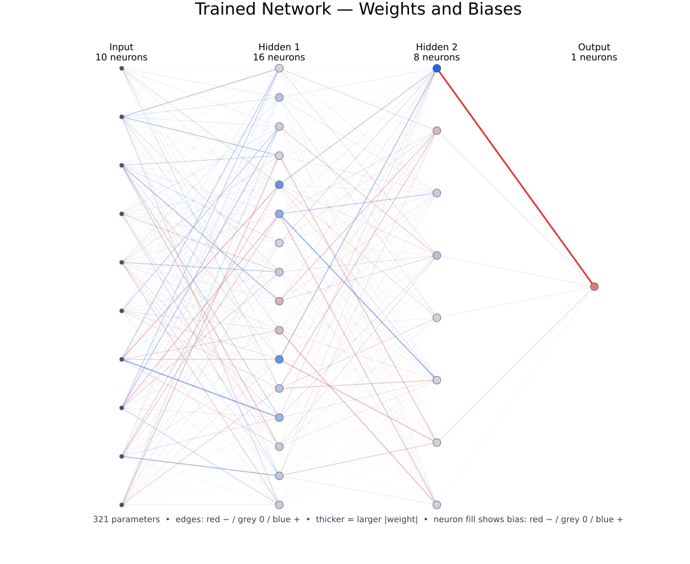
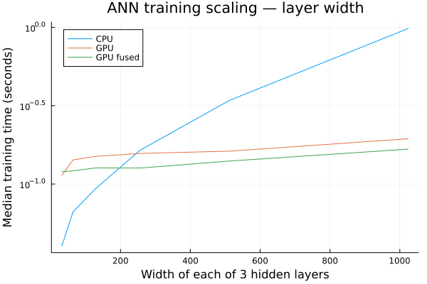
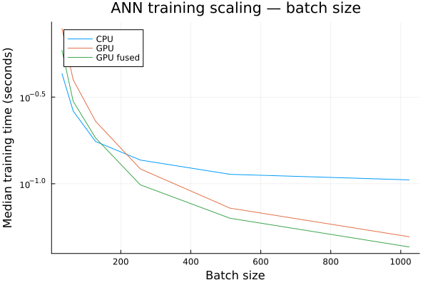

# learnProject_ANN_Network

This repository contains a small artificial neural network written from scratch in Julia. It implements mini-batch training with backpropagation and stochastic gradient descent in configurable network architectures for binary and multi class decision problems. The project was intended for learning the underlying math and for comparing the scaling of equivalent CPU, GPU, and kernel-fused GPU implementations.

<p align="center">
<br>
<b>Example of a fully connected network trained with this framework to classify a client's probability of defaulting on a loan. Blue and red edges represent positive and negative weights, while line thickness represents weight magnitude. Similarly, blue and red nodes represent positive and negative biases.</b>
</p>

## Network

The network is a configurable multilayer perceptron. Input samples pass through one or more fully connected hidden layers with ReLU activation. The output layer uses a sigmoid for binary classification and softmax for multiclass classification. During backpropagation, output and hidden-layer errors are used to calculate weight and bias gradients, which are applied with stochastic gradient descent.

The hidden-layer widths, batch size, number of epochs, and learning rate can be changed directly in `test_CPU.jl` or `test_CPU_GPU.jl`. Trained weights and biases are saved as JLD2 files in `trained_networks/` and can then be evaluated with `src/test_network.jl`.

## Implementations

- `src/train_network_cpu.jl` — CPU implementation that uses preallocated arrays and in-place matrix operations where possible.
- `src/train_network_gpu.jl` — equivalent GPU implementation using `AMDGPU.jl` and ROCm arrays. Matrix multiplication and element-wise operations remain separate GPU operations.
- `src/train_network_gpu_fused.jl` — GPU implementation with custom fused kernels. Bias addition and activation, softmax and output-delta calculations, the ReLU backward pass, and SGD parameter updates are combined to reduce kernel launches and intermediate operations.

All three approaches implement the same network and training procedure. The ordinary GPU version demonstrates the benefit of moving matrix-heavy work to a GPU, while the fused version also reduces the launch overhead that becomes important when performing many relatively small element-wise operations.

# Requirements

- Julia 1.10 or higher
- An AMD GPU supported by `AMDGPU.jl` for the GPU implementations
- Julia packages:
  - `AMDGPU`
  - `CSV`
  - `DataFrames`
  - `JLD2`
  - `MLDatasets`
  - `Plots` (benchmark plots only)
  - `XLSX`

Install the packages from the Julia REPL:

```julia
using Pkg
Pkg.add(["AMDGPU", "CSV", "DataFrames", "JLD2", "MLDatasets", "Plots", "XLSX"])
```

The CPU example does not require an AMD GPU or the `AMDGPU` package to be loaded.

## Data

The example data-preparation script supports MNIST and three credit-risk datasets:

- [MNIST](https://github.com/JuliaML/MLDatasets.jl) — downloaded automatically by `MLDatasets.jl`.
- [Give Me Some Credit](https://www.kaggle.com/c/GiveMeSomeCredit) — place `cs-training.csv` in `raw_data/`.
- [Default of Credit Card Clients](https://archive.ics.uci.edu/dataset/350/default+of+credit+card+clients) — place the data in `raw_data/default_of_credit_card_clients.xlsx`.
- [Statlog (German Credit Data)](https://archive.ics.uci.edu/dataset/144/statlog+german+credit+data) — place the numeric data in `raw_data/german.data-numeric`.

The raw datasets are not included in this repository. After downloading them, prepare all available example datasets from the repository root with:

```bash
julia prepare_all_data.jl
```

Individual preparation functions can also be called from `src/prepare_data.jl`. The resulting train/test files are written to `prepared_data/`.

The training code is not restricted to these datasets. Any data can be used when stored in the accepted layout: `x_train` and `x_test` have shape `(number_of_features, number_of_samples)`. For binary classification, labels are a `1 × number_of_samples` array and `number_of_classes = 1`; for multiclass classification, labels are integer class indices and `number_of_classes` is the number of classes. Store `x_train`, `y_train`, and `number_of_classes` in the training JLD2 file, and the corresponding test variables in the test JLD2 file.

## Quick start

For a CPU-only run, select a dataset and configure the network near the top of `test_CPU.jl`, then run:

```bash
julia test_CPU.jl
```

To time and compare all three implementations, configure `test_CPU_GPU.jl` and run:

```bash
julia test_CPU_GPU.jl
```

Both scripts warm up the training functions before timing them, train the requested network, save it under `trained_networks/`, and report its test accuracy.

## Scaling results

Part of this exercise was to investigate how the CPU and GPU implementations scale for larger models. The plots below, together with a brief discussion, summarize some of the benchmark results. They compare the time required for one training epoch on a fixed subset of MNIST, evaluated on my CPU and GPU.

| Layer-width scaling | Batch-size scaling |
|:------------------:|:-------------------:|
|  |  |
| This graph shows that the GPU implementations scale much better as layer width increases. At small layer widths, CPU training is faster because of the overhead involved in transferring data to the GPU and launching kernels. At larger layer widths, matrix multiplication dominates the computation, showing the benefit of GPU training as CPU training time increases much more rapidly. At a width of 1024, the CPU takes about 0.98 s, the ordinary GPU 0.19 s, and the fused GPU 0.17 s. | This graph shows that the GPU implementations scale much better as batch size increases. At small batch sizes, CPU training is faster because of the overhead involved in transferring data to the GPU and launching kernels. As the batch size increases, the matrix operations become large, and GPU training time decreases much more rapidly than CPU training time. |


Overall, the experiments show that GPU training scales significantly better than CPU training as the model size and workload increase. While kernel fusion does not change the asymptotic scaling compared to the unfused GPU implementation, it consistently improves performance by reducing kernel launch overhead and memory traffic, resulting in a nearly constant speedup across all tested configurations.

The benchmark scripts and the depth and epoch scaling plots are in `visualisation/`. Run a quick sweep with:

```bash
julia visualisation/run_scaling_benchmarks.jl
julia visualisation/plot_scaling_benchmarks.jl
```

